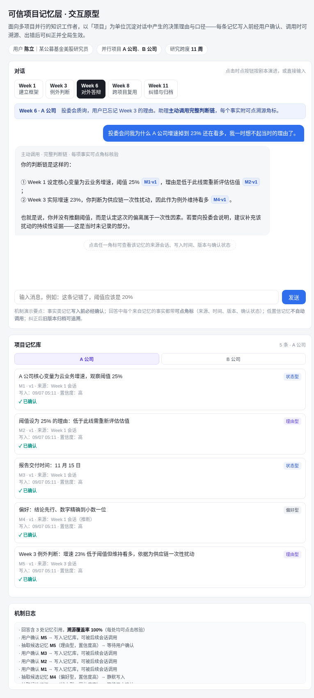

# 可信项目记忆层 · 交互原型

> 长期记忆 AI 助理的产品原型。以「项目」为单位沉淀对话中产生的决策理由与口径——每条记忆**写入前经用户确认、调用时可溯源、出错后可纠正并全局生效**。



---

## 一、快速开始

纯静态项目，**零依赖、零构建**，三种方式任选：

| 方式 | 操作 |
|---|---|
| 直接打开 | 双击 `index.html`，浏览器即可运行 |
| VS Code | 装 Live Server 插件 → 右键 `index.html` → Open with Live Server |
| 命令行 | 在项目根目录执行 `python3 -m http.server 8000`，访问 `http://localhost:8000` |

Cloud Studio 中打开工作空间后，点击右上角「预览」→ 选择端口即可看到页面。

> 建议用本地服务方式打开。`file://` 协议下页面功能完整，但部分浏览器对本地文件的安全策略较严，用 HTTP 更稳妥。

在线版本（内网可访问）：


扫码或访问 <https://picasso-private-1251524319.cos.ap-shanghai.myqcloud.com/formula-static/dibp/uvksqrah/index.html>

---

## 二、目录结构

```
workspace/
├── index.html      # 页面入口：语义化结构 + 各功能区容器（不含样式与逻辑）
├── style.css       # 样式：CSS 变量主题 + Grid 主布局 + Flexbox 气泡流
├── script.js       # 交互逻辑：记忆数据模型、五个时点剧本、溯源弹窗、自由输入
├── img/
│   ├── output.png  # 页面预览图
│   └── qr-code.png # 在线版本二维码
└── README.md       # 本文件
```

三层职责严格分离，改动互不影响：调配色只改 `style.css` 的 `:root`；改剧本文案只改 `script.js` 的 `SCENE` 与 `runW*` 函数；调页面骨架只改 `index.html`。

---

## 三、产品背景

**目标用户**：多项目并行的知识工作者。原型以某公募基金美股研究员「陈立」为角色，同时跟踪 A、B 两家公司，单个标的研究周期约 11 周。

**核心痛点**：通用 AI 助手把每次对话当成新会话。研究员在 Week 3 做过的例外判断，到 Week 6 投委会质询时既想不起理由，也无法向他人复述完整判断链。

**产品主张**：记忆存取本身已被大量方案商品化，真正的立足点在记忆之上的**可信度治理**——用户能看见记了什么、知道答案基于哪条记忆、发现错误后能改掉且改动全局生效。

---

## 四、五个时点剧本

点击页面上方时点按钮按顺序演进，每个时点验证一项机制：

| 时点 | 场景 | 验证机制 |
|---|---|---|
| Week 1 | 建立研究框架 | 抽取候选记忆，**写入前逐条确认**；偏好型记忆静默写入但可见可删 |
| Week 3 | 财报触发例外判断 | 主动调出既有阈值，把「为什么这次放行」记为**理由型**记忆 |
| Week 6 | 投委会质询 | 主动调用**完整判断链**，每个事实附可点溯源角标 |
| Week 8 | 切换到 B 公司 | 默认**项目隔离**，跨项目引用需显式确认并标注来源项目 |
| Week 11 | 发现依据有误 | 纠正生成 v2、**旧版本归档可追溯**、标记下游引用、关联记忆降为低置信 |

**建议演示顺序**：Week 1 逐条点「确认写入」→ Week 3 确认例外判断 → Week 6 点开角标看溯源卡 → Week 8 试跨项目引用 → Week 11 执行纠正。跳步也能运行，但 Week 11 依赖 Week 3 生成的记忆。

输入框可自由交互：输入「记住…」走确认流程；输入含「记错了 / 不对」走纠错定位；无相关记忆时明确回复不凭推测作答。

---

## 五、三个设计细节

**角标是完整溯源卡，不只是来源标注。** 点开显示记忆编号与当前版本、所属项目、来源会话、写入时间、确认状态、置信度，以及版本历史（被替换的原始表述与替换原因）。这是「记忆作为一等产品对象」最直观的体现。

**置信度门控是可见的。** Week 11 纠错后，关联的阈值记忆自动降为低置信，右侧面板顶部弹出提示说明它不再自动注入回答，只在用户显式追问时提示可能已过期。

**机制日志把不可见的判断显性化。** 每次抽取、确认、拒绝、纠正、跨项目命中都会记一行，包括「检索无命中 → 不注入任何记忆」这种反向动作——证明产品在什么时候选择了「不做」。

---

## 六、涉及的前端知识点

原型刻意只用原生技术栈，便于阅读与二次修改。

### CSS

- **CSS 变量**（`:root` 自定义属性）：全部配色、圆角、描边集中定义，换主题只改一处
- **Grid 布局**：`grid-template-columns: 1fr 330px` 实现主内容 + 侧栏；配合 `@media(max-width:900px)` 在窄屏折叠为单列
- **Flexbox**：`flex-direction: column` 构建消息流，`align-self` 控制用户 / 助理气泡左右分列
- **`min()` 函数**：`min-width: min(86%, 430px)` 让确认卡在宽窄屏都不失衡
- **状态类切换**：`.on` / `.arch` / `.stale` 等类名承载状态，样式与逻辑解耦

### JavaScript

- **数据驱动渲染**：所有记忆存于 `mems[]` 数组，`renderMem()` 按数组重绘面板，不做局部 DOM 修补
- **版本化数据结构**：每条记忆带 `ver` 与 `hist[]`，纠正时旧版本 `unshift` 进历史而非覆盖——原型层面就体现「可追溯」
- **正则替换做富文本**：`withCite()` 用 `String.replace` 把正文里的 `[M1]` 占位符换成可点角标，实现「文案与引用分离」
- **`setTimeout` 编排时序**：剧本用嵌套定时器模拟真实对话节奏，避免所有气泡同时出现
- **事件委托与内联回调**：动态生成的按钮用 `onclick` 直接绑定，配合 `closest()` 定位并替换所属卡片
- **模板字符串**：多行 HTML 片段用反引号拼接，保持可读性

---

## 七、二次修改指引

| 想改什么 | 改哪里 |
|---|---|
| 配色、圆角、字号 | `style.css` 顶部 `:root` |
| 用户角色、项目名称 | `script.js` 中 `PROJ` 常量与 `index.html` 的 `.who` 区块 |
| 时点数量与名称 | `script.js` 中 `STEPS` 数组 + `SCENE` 文案 + 对应 `runW*()` 函数 |
| 对话文案 | 各 `runW*()` 函数内的 `bubble()` 调用 |
| 记忆分类 | `script.js` 中 `label()` 函数与 `style.css` 的 `.t-*` 样式 |
| 加入数据持久化 | 在 `addMem` / `confirmMem` / `correctMem` 后写 `localStorage.setItem('mems', JSON.stringify(mems))`，页面初始化时读回 |

---

## 八、已知边界

原型的目标是验证机制与交互，不是实现系统，因此：

- 记忆抽取是**预设剧本**，非真实模型抽取；自由输入走关键词规则匹配
- 数据存于内存，刷新页面即重置（如需保留见上表最后一行）
- 无后端、无鉴权、无多用户，单页面单会话

这些边界不影响机制演示：确认闸门、溯源角标、版本归档、项目隔离、置信度门控这五条链路都是完整可点击走通的。
